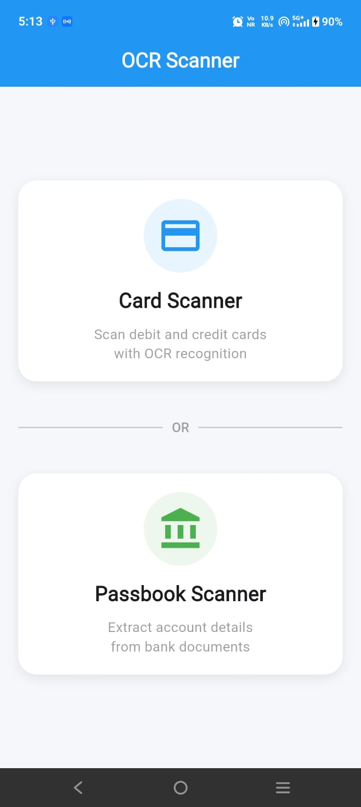
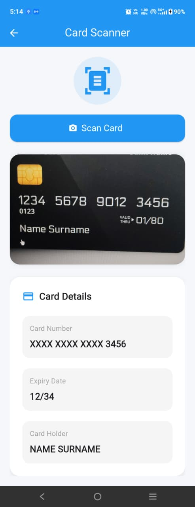
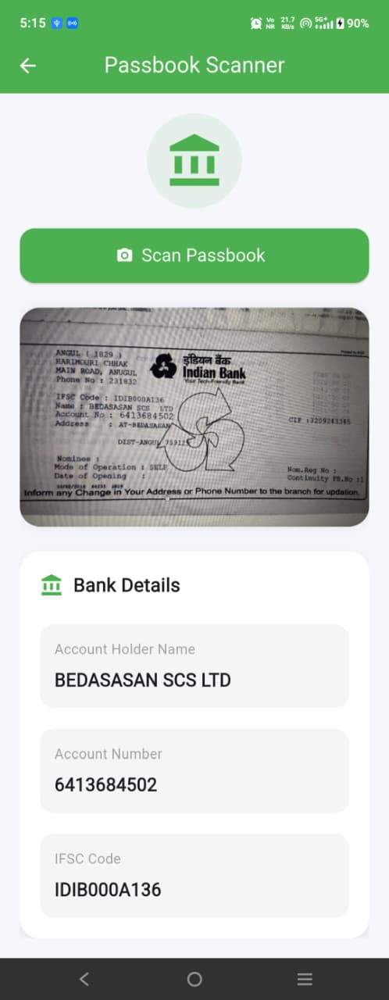

# Flutter OCR Scanner

A Flutter application that scans debit/credit cards and bank passbooks using OCR and extracts structured data using custom manual parsing logic.

---

# Features

## Card Scanner

* Scan debit/credit cards using camera or image upload
* Extract:

  * Card Number
  * Expiry Date
  * Card Holder Name
* Luhn Algorithm validation
* Masked card number display
* Structured UI output

## Passbook Scanner

* Scan/upload passbook images
* Extract:

  * Account Holder Name
  * Account Number
  * IFSC Code
* Structured UI output

---

# Tech Stack

* Flutter
* GetX
* Google ML Kit OCR

---

# Libraries Used

```yaml
get:
google_mlkit_text_recognition:
image_picker:
```

---

# Project Architecture

Feature-first Clean Architecture structure was used.

```txt
lib/
│
├── core/
│   ├── services/
│   ├── utils/
│
├── features/
│   ├── card_scanner/
│   ├── passbook_scanner/
│
├── routes/
│
└── main.dart
```

---

# Manual Parsing Logic

No third-party parsing libraries were used.

Custom parsing was implemented using:

* RegExp
* String processing
* Conditions and filtering
* Luhn Algorithm validation

---

# Edge Cases Handled

## Blurry or Partial Scans

OCR output is cleaned and filtered before parsing.

## OCR Misreads

Handled common OCR issues:

* O → 0 correction

## Multiple Numbers in OCR

Parser selects:

* Valid Luhn card number
* Longest account number

## Missing Fields

Displays:

* "Not Found"

when data is unavailable.

## Duplicate Scans

Latest scanned result replaces previous scan.

---

# What Was Avoided

* No backend services used
* No parsing libraries used
* Raw OCR text is not displayed directly

---

# Assumptions Made

* Card numbers are 16 digits
* IFSC format follows standard Indian banking pattern
* OCR text quality is reasonably readable

---

# What Was Skipped

## Real-time Camera Detection

Implemented image capture/upload flow instead of continuous live detection due to assignment time constraints.

## Advanced OCR Preprocessing

Image enhancement and preprocessing techniques were not added to keep implementation simple and focused on parsing logic.

---

# How to Run

## 1. Clone Repository

```bash
git clone https://github.com/sushma-star/flutter_ocr_scanner.git
```

## 2. Open Project

```bash
cd flutter_ocr_scanner
```

## 3. Install Dependencies

```bash
flutter pub get
```

## 4. Run Project

```bash
flutter run
```

---

# Run Tests

```bash
flutter test
```

---

# Test Coverage

Implemented tests for:

* Card Parser
* Passbook Parser
* Luhn Validation

---

# Sample Valid Test Cards

```txt
4111 1111 1111 1111
5555 5555 5555 4444
```

---
# Screenshots

## Home Screen



---

## Card Scanner



---

## Passbook Scanner




# Author

Sushma Akula
